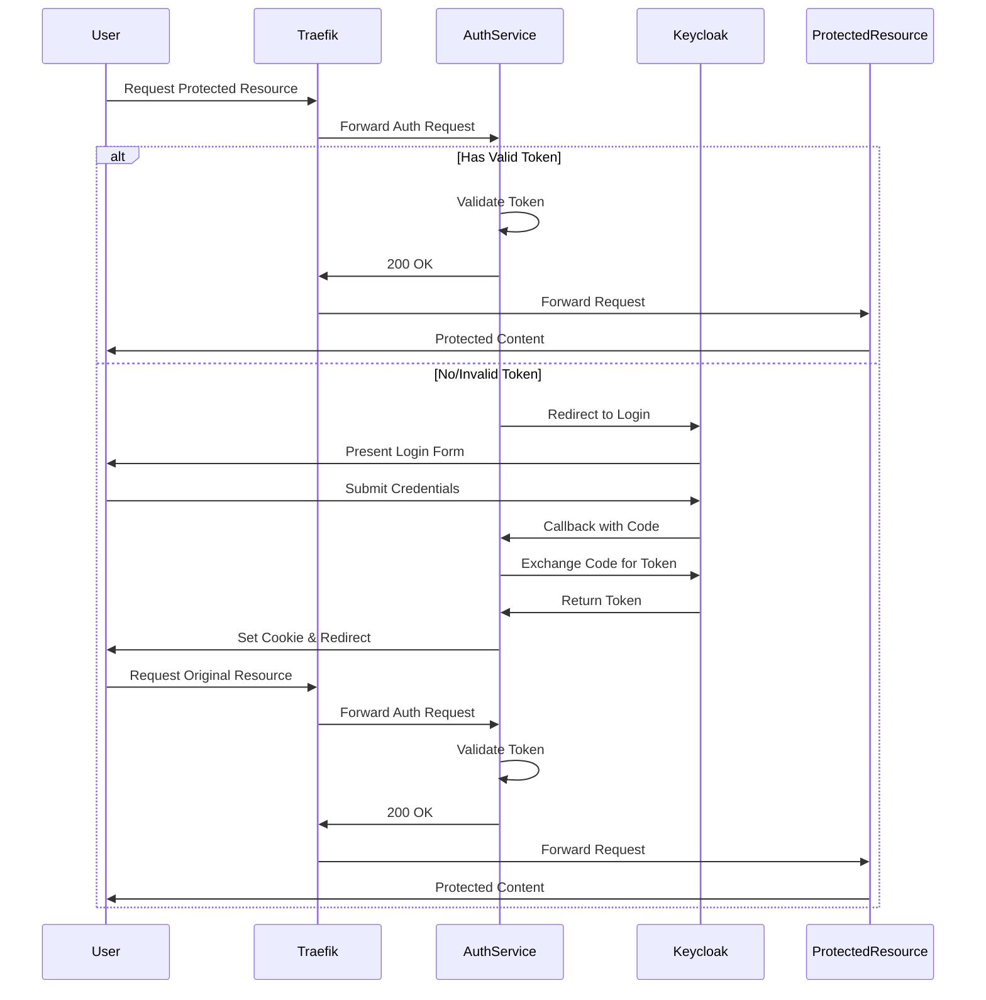

# Authentication Service

## Overview
This service provides centralized authentication using Keycloak and Traefik for protected resources. It implements a forward authentication mechanism where Traefik forwards authentication requests to a Python-based authentication service that integrates with Keycloak.

## Architecture
The authentication service consists of several components:
- **Traefik**: Acts as the reverse proxy and forwards authentication requests
- **Python Auth Service**: Handles authentication flow and token validation
- **Keycloak**: Provides identity and access management
- **MariaDB**: Stores Keycloak configuration and client secrets

## Authentication Flow



## Components

### Traefik Configuration
Traefik is configured to use forward authentication for protected resources. Example configuration:

```yaml
labels:
  - "traefik.enable=true"
  - "traefik.http.routers.protected-service.middlewares=forward-auth@docker"
  - "traefik.http.middlewares.forward-auth.forwardauth.address=https://domain/oauth"
```

### Authentication Service
The Python-based authentication service handles:
- Token validation
- Session management
- Keycloak integration
- Redirect flow management

Key files:
- `app.py`: Main application entry point
- `auth_utils.py`: Authentication utility functions
- `routes.py`: Route handlers
- `config.py`: Configuration management

### Keycloak Setup
Required Keycloak configuration:
1. Create a new client with:
   - Client ID: `traefik-client`
   - Access Type: `confidential`
   - Valid Redirect URIs: `https://domain/oauth/callback`
   - Web Origins: `https://domain`

2. Configure user roles and permissions

## Installation

### Prerequisites
- Docker and Docker Compose
- Python 3.11+
- Keycloak instance
- MariaDB

### Environment Variables
```env
KEYCLOAK_REALM=master
KEYCLOAK_CLIENT_ID=traefik-client
SSO_URL=https://domain/iam
DOMAIN=domain
HOSTNAME=hostname
```

### Deployment
1. Build the Docker image:
```bash
docker build -t auth-service .
```

2. Start the service:
```bash
docker-compose up -d
```

## Security Considerations
- All communication is over HTTPS
- Tokens are stored in HTTP-only cookies
- Token validation includes signature verification
- Client secrets are stored securely in database
- Regular key rotation is supported

## Troubleshooting

### Common Issues

1. Token Validation Failures
```
ERROR - Token validation failed: Signature verification failed
```
- Check if the correct public key is being used
- Verify token hasn't expired
- Ensure proper audience configuration

2. Redirect Loop
```
ERROR - No valid authorization found, redirecting to login
```
- Verify cookie settings
- Check token validation
- Confirm Keycloak configuration

### Logging
The service uses structured logging with different levels:
- DEBUG: Detailed information
- INFO: General operational messages
- ERROR: Issues requiring attention

Example log output:
```
INFO - Starting token validation
DEBUG - Token uses key ID: xyz
INFO - Token successfully validated
```

## API Reference

### Auth Endpoint
- Path: `/oauth`
- Method: `GET`
- Headers:
  - `X-Original-Url`: Original requested URL
  - `Cookie`: Authentication token

### Callback Endpoint
- Path: `/oauth/callback`
- Method: `GET`
- Query Parameters:
  - `code`: Authorization code
  - `state`: Original URL

## Contributing
1. Fork the repository
2. Create a feature branch
3. Submit a pull request

## License
MIT License
